##A study of the distribution of primes using R

This repository is a collection of R scripts that visually represent some of the concepts exposed in [Derbyshire, J. (2004)] using a numerical analysis approach.

[Derbyshire, J. (2004)] main objective is to show the connection between the distribution of primes and the zeros of the zeta function: this is the main result of Riemann's 1859 paper "On the number of primes less than a given Quantity" that also contains the unsolved Riemann Hypothesis.

###Series
A series is the sum of the terms of a sequence of numbers. The series is convergent if approaches a given number, otherwise divergent.  
An example of convergent series is  

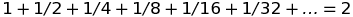
 
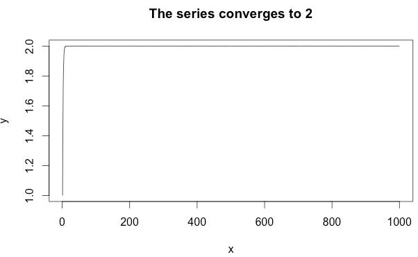
 
<a href="R/ConvergentSeriesTo2.R">R code</a>

The harmonic series diverges  

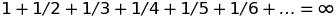
 
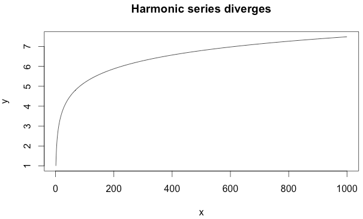
 
<a href="R/HarmonicSeries.R">R code</a>

###Functions
A function is a relation between an input and a single output according to some rule.  
Example of functions:  
* a function whose rule is to count the number of factors for a given argument (referred also as d(N))  
* a function whose rule is to count the number of prime factors for a given argument  

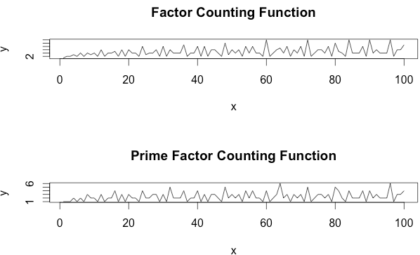
 
<a href="R/FactorCountingFunction.R">R code</a>

###The Prime Counting Function
The Prime Counting Function π(N), the central study of the Riemann's 1859 paper, is defined to be the number of primes up to N  

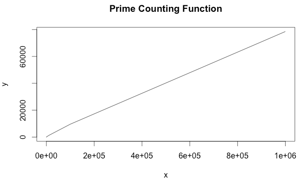
 
<a href="R/PrimeCountingFunction.R">R code</a>

The Prime Number Theorem (PNT) states

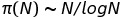
 
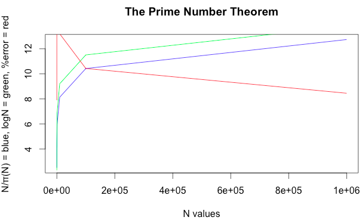
 
<a href="R/ThePrimeNumberTheorem.R">R code</a>

The log function is close to N/π(N) and the error (the red line) gets smaller the larger is N.  

The log integral function Li(x) is defined as  

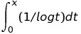
 
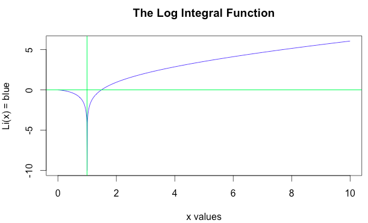
 
<a href="R/TheLogIntegralFunction.R">R code</a>

The PNT (improved version) states  

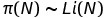
 
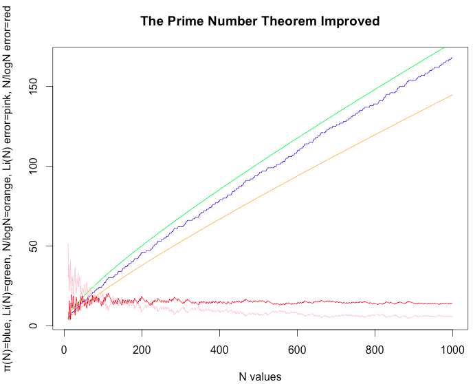
 
<a href="R/ThePrimeNumberTheoremImproved.R">R code</a>

The log integral function is a much better estimate than N/logN.  

Von Koch's 1901 result  

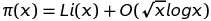
 

 
<a href="R/VonKochResult.R">R code</a>

That is π(x)-Li(x) is big oh of sqrt(x)*logx, meaning π(x)-Li(x) never exceeds some fixed multiple of sqrt(x)*logx.  
The result is valid if the Riemann Hypothesis is true (stated in the Riemann's Zeta Function section below).  

Prime Counting step Function for real number π(x)  

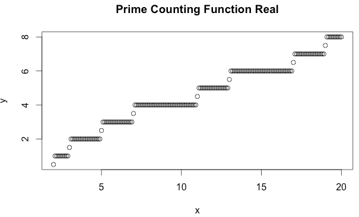
 
<a href="R/PrimeCountingFunctionReal.R">R code</a>

defined as the number of primes up to the real number x.  
Riemann defined another step function in terms of π(x)  

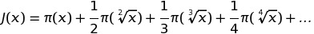
 
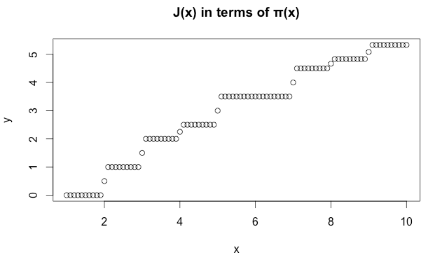
 
<a href="R/JFunctionReal.R">R code</a>

Inverting the above relationship  

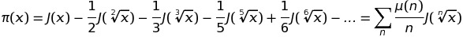

###Riemann's Zeta Function
The Basel series converges (each term is the square of the corresponding term in the harmonic series which diverges)
	1 + 1/2^2 + 1/3^2 + 1/4^2 + 1/5^2 + 1/6^2 + ... = pi^2/6
	graph
	R code link
This is Euler's solution of the Basel problem which also gave a closed form for all even number. For odd numbers there is no closed form.

The Riemann zeta function
	Z(s) = 1 + 1/2^s + 1/3^s+ 1/4^s + 1/5^s + 1/6^s + ... = SUM n^-s (see page 79)
	graph
	R code link
When s = 1, the zeta function is the harmonic series and it has no value (inf).
When s = 2, the zeta function is the Basel series and the value is  i^2/6.

The series describes only part of the zeta function (s > 1).
Zeta function extended domain using
	Z(s) = n(s) + (1-1/2^s-1) for s > 0 and s < 1 (see page 146)
	Z(1-s) = … for s < 0 (see page 147)
	graph
	R code link
The zeta function is zero when s is a negative even number. These are the trivial zeros.

Extending the domain to complex numbers, the Riemann Hypothesis states that
	all non-trivial zeros of the zeta function have real part one-half
In other words, the zeros are complex numbers of type 1/2+Ti, thus all lying on the critical line Re(s) = 1/2.

Value complex plane, showing points coming from the critical line
	graph
	R code link

Number of zeros up to the height T (imaginary part of complex number)
	N(T) x/(2*pi) * log(x/(2*pi)) - x/(2*pi)
	graph
	R code link

Zeta function using Moebius function
	1/Z(s) = sum over n of moebius(n)/n^s
	graph
	R code link

As important as the Moebius function is its cumulative value called Mertens's function, for which
	M(k) = O(k^1/2)
	graph
	R code link
The above is equivalent to Denjoy's Probabilistic Interpretation (see on wiki): 
	a square-free number has either an even or odd number of prime factors with a 50-50 probability

###Riemann's 1859 paper main result
Euler product formula
	SUM n^s-1 = PROD 1-p^-s^-1 (see p105)
On the left hand a sum including all positive whole numbers, on the right hand a product including all prime numbers.
	graph
	R code link

Riemann, in his 1859 paper,  rewrote the above formula in calculus version
	expression 19-6 (see page 309)
	graph
	R code link

By inverting the expression above
	J(x) = … (page 328)
	graph
	R code link
This represent the main result of Riemann's 1859 paper.
It follows that tt can be expressed in terms of j, j in terms of zeta, therefore tt can be expressed in terms of zeta function.

That is the distribution of primes (TT(x)) depends on the non-trivial zero's of the zeta function. 

Since the Riemann Hypothesis is a statement on these zeros, if it is true, some properties follow.
However if the Riemann Hypothesis is false, Riemann's main result is still valid, in fact it was proved by von Mangoldt in 1895.

###References
* [Derbyshire, J. (2004)] Prime Obsession: Bernhard Riemann and the Greatest Unsolved Problem in Mathematics, New York: Penguin
* [Edwards, H. M. (2001)] Riemann's Zeta Function, New York: Dover 

[Derbyshire, J. (2004)]:http://www.amazon.com/exec/obidos/ASIN/0452285259/ref=nosim/weisstein-20
[Edwards, H. M. (2001)]:http://www.amazon.com/exec/obidos/ASIN/0486417409/ref=nosim/weisstein-20

